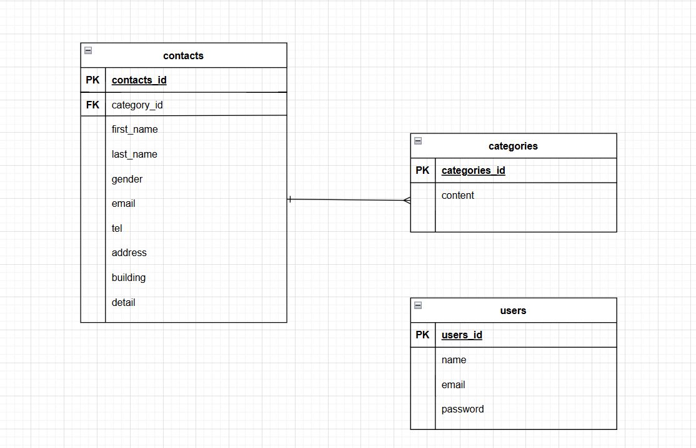

# お問い合わせフォーム

# プロジェクト作成
```
composer create-project laravel/laravel check-test
cd check-test
```

## Dockerビルド
- Docker用ファイル作成
```
touch Dockerfile docker-compose.yml
```

- Dockerビルド&起動
```
docker-compose up -d --build
```

## データベース作成
```
docker-compose exec mysql mysql -u root -p
CREATE DATABASE check-test CHARACTER SET utf8mb4 COLLATE utf8mb4_unicode_ci;
```

## Laravel環境設定
```env
DB_CONNECTION=mysql
DB_HOST=mysql
DB_PORT=3306
DB_DATABASE=check_test
DB_USERNAME=laravel_user
DB_PASSWORD=laravel_pass
```

## マイグレーション
```
php artisan migrate
```

## シーディング
```
php artisan make:seeder ContactSeeder
php artisan db:seed --class=ContactSeeder
```

## 使用技術(実行環境)
- Laravel Framework 8.83.8

- PHP 8.4.8

- mysql  Ver 8.0.26

- Docker version 28.2.2

- Docker Compose version v2.37.1

## ER図


## URL
- 開発環境：http://localhost/